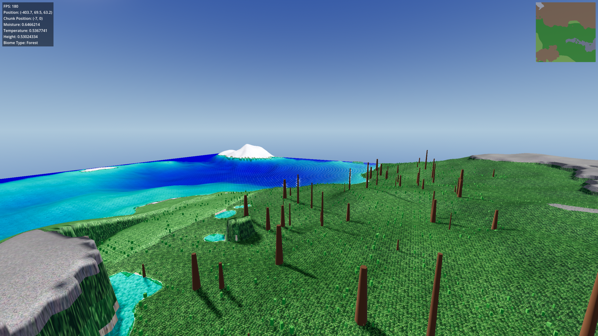
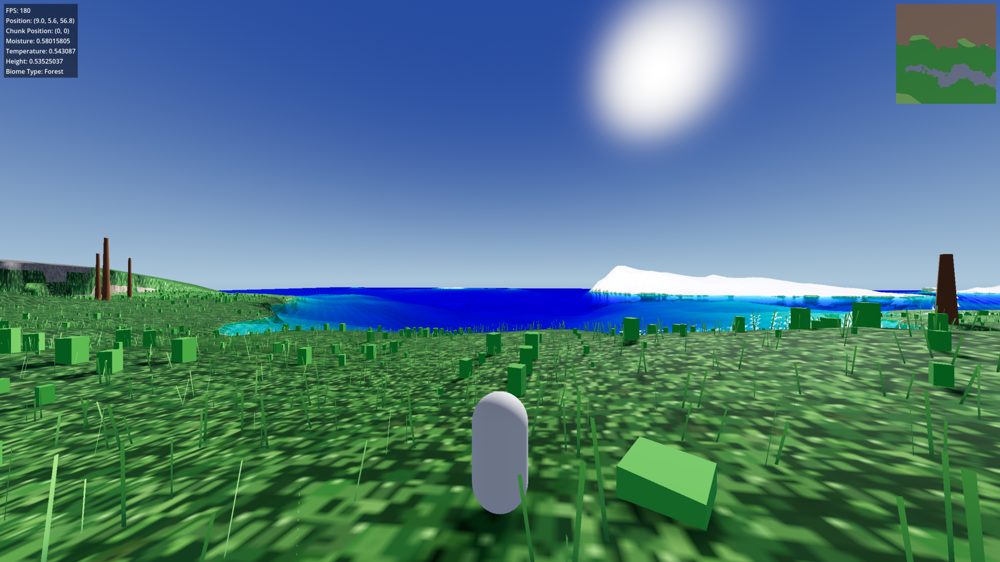

# Adventure-Game

**An open-world Godot 4.x terrain exploration demo** — endless procedurally generated worlds with six distinct biomes, real-time chunk streaming, shader-animated vegetation, and a minimap.

Built with C# and Godot's FastNoiseLite for seamless, fully deterministic procedural generation.





---

## Features

- **Endless procedural terrain** — seamless chunk-based generation that streams in around the player
- **6 biomes** — ocean, grassland, forest, mountain, snow, desert, each with its own height curve, moisture/temperature-driven placement, and terrain texturing
- **Shader-animated grass** — thousands of GPU-instanced grass blades that sway in the wind with noise-based height/color variation, anchored to the terrain surface
- **Decoration framework** — biome-aware placement of trees, stones, plants, and grass; ships with simple primitive placeholder meshes you can swap for your own models
- **Water plane** that follows terrain contours
- **On-the-fly chunk threading** — terrain is generated on background threads with deferred main-thread assignment
- **Minimap overlay** that renders the procedural world
- **Debug overlay** — FPS, player position, biome, and terrain info

## Requirements

| Tool | Version |
|------|---------|
| [Godot](https://godotengine.org/download) | 4.7 **mono/.NET edition** |
| [.NET SDK](https://dotnet.microsoft.com/download) | 8.0+ |

## Quick Start

```bash
git clone <your-repo-url>
cd Adventure-Game
```

1. Open the project in the **Godot .NET editor** (`godot --editor --path .`)
2. Build from the editor or run:
   ```bash
   dotnet build
   ```
3. Press **Play** (or run `godot --path .`)

## Controls

| Input | Action |
|-------|--------|
| `WASD` | Move |
| `E` / `Q` | Fly up / down (free camera) |
| Mouse | Look around |
| Mouse wheel | Adjust free-camera speed |
| `Space` | Jump |
| `Tab` | Toggle player / free camera |
| `R` | Reload current scene |
| `Esc` | Release mouse cursor |
| `F11` | Toggle fullscreen |
| `X` | Quit |

## Project Structure

```
├── scripts/            # C# source
│   ├── TerrainController.cs   # Chunk system, noise, biome logic
│   ├── PlayerController.cs    # Character movement + camera
│   ├── Biomes/                # Per-biome generator resources (height/detail/erosion)
│   ├── Decorations/           # Decoration framework + placeholder meshes (trees/stones/plants/grass)
│   ├── Grass/                 # Shader-based blade grass generator
│   ├── Overlay/               # Debug HUD + minimap
│   └── Water/                 # Water plane generator
├── scenes/             # Godot scenes (main, player, camera, sky)
├── shaders/            # GLSL shaders (terrain, grass, water)
└── assets/Blockbench/  # Original pixel-art terrain textures + Blockbench sources
```

## Tech Stack

- **Engine:** Godot 4.7 (mono)
- **Language:** C# / .NET 8
- **Generation:** FastNoiseLite (height, moisture, temperature, detail noise)
- **Rendering:** Custom GLSL shaders, MultiMesh instancing, vertex-color biome selection

## License

Distributed under the [MIT License](LICENSE). See `LICENSE` for details.